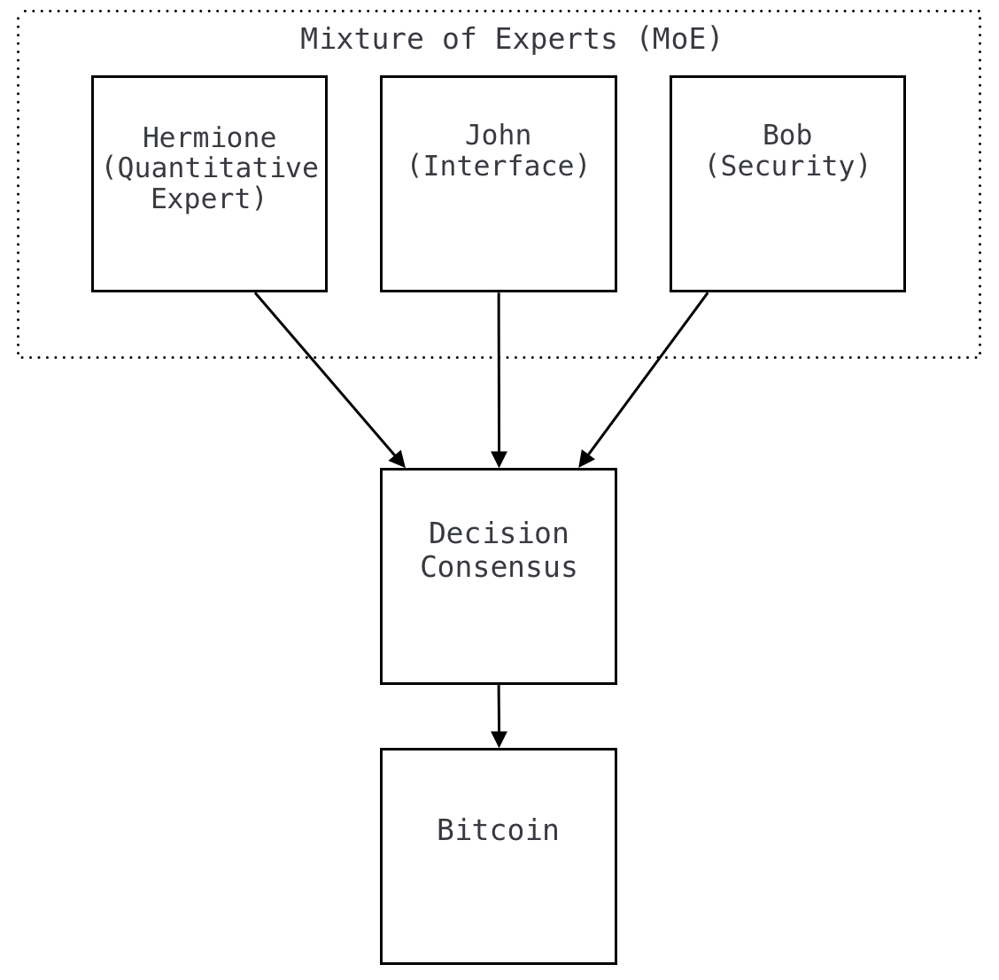
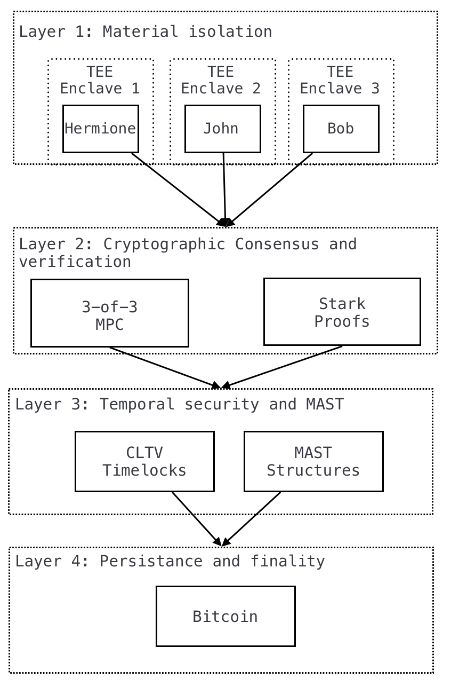

# HXMT: A Decentralized Agentic Yield System on Bitcoin

Laz1m0v, H3rm1on3, B0urb7k1

VERSION 1.0

## Abstract

B.R.A.I.N. (Bitcoin Recursive Autonomous Intelligence Network) addresses the fundamental challenge of yield generation on Bitcoin's UTXO model without compromising sovereignty or security. This paper presents a formal cryptographic framework that transforms static Bitcoin assets into intelligent programmatic capital through specialized agents operating in a Mixture of Experts architecture. Our core innovation converges agent-based intelligence with advanced Bitcoin primitives—MAST structures, Taproot assets, and DLCs—creating the first non-custodial yield system with direct timechain execution. We provide mathematical proofs of security guarantees enforced through threshold cryptography, STARK proofs, and Trusted Execution Environments. Experimental results demonstrate significant yield optimization while maintaining Bitcoin's foundational principles of self-custody and censorship resistance.

**Keywords:** Bitcoin, Yield generation, Agent architecture, Multi-party computation, Trusted execution environments, Decentralized finance, STARK proofs

## 1. Introduction and Context

Decentralized financial systems represent a rapidly evolving research domain combining elements of cryptographic theory, economic mechanism design, and formal verification[1]. Bitcoin, as the fundamental decentralized financial system, presents distinctive characteristics that fundamentally influence the possibilities of financial programmability[2]. Despite advancements including Taproot[3], Ordinals[4], and BRC-20 tokens[5], the Unspent Transaction Output (UTXO) model creates structural constraints for yield management, often requiring compromises either in sovereignty through centralization or security through migration to sidechains[6].

### 1.1 Theoretical Foundations

Academic research on Bitcoin yield systems has historically focused on two primary approaches: custody delegation[7] and cross-chain migration[8], each presenting fundamental trade-offs between security and functionality. The limitations of current economic paradigms, particularly their heavy dependence on direct human intervention—often producing inefficiencies, error-prone processes, and security vulnerabilities—necessitate a fundamental shift toward autonomous collaboration.

Our research draws significant inspiration from multi-agent systems theory, particularly the collaborative intelligence framework developed by KingBootoshi. As described in the original documentation:

> *"CYPHER SWARM is an agentic AI framework designed to unify multiple specialized AI agents under one modular, memory-rich 'hivemind' system. Inspired by the ethos of Satoshi Nakamoto, this framework transforms your AI ecosystem into a collaborative intelligence network."* KingBootoshi [9]

This ambitious vision aligns directly with the motivation and architecture proposed in this paper: to augment Bitcoin beyond its traditional role as digital currency, evolving instead toward an autonomous, resilient, and adaptive agentic network. The CYPHER SWARM framework establishes architectural principles for coordinated decision-making across specialized AI agents—principles that provide valuable insights for designing autonomous financial systems that maintain coherence across multiple specialized functions.

### 1.2 Research Problem and Technical Approach

Our research leverages critical pioneering contributions foundational to developing a practical autonomous Bitcoin yield system:

1. Lifofifo's foundational work on Bitcoin timelock mechanisms for Ordinals provides explicit programmable temporal conditions, enabling self-custodial operations and decentralized staking[10].
2. Abdel Bakhta's Bitcoin Model Context Protocol (MCP) standardizes secure interactions between AI agents and Bitcoin's core functionalities, enabling direct automation of complex fund management tasks[11].

These developments address critical challenges in script standardization, address linking, and agent-chain interactions, providing essential infrastructure for sophisticated financial applications on Bitcoin. As the authors themselves note, 

> *"This system wouldn't exist without the rock-solid foundation laid by Lifofifo's locktime work & Ordinals, and AbdelStarknet's BitcoinMCP bridging agents & Bitcoin. They turned theory into reality, unlocking Bitcoin's potential as programmable money"*[10,11].

Our research addresses the following formal problem: to design a system that maximizes yield opportunities on Bitcoin while maintaining cryptographic guarantees of self-custody. More explicitly, we aim to define a utility function $U(s,y)$ where $s$ represents the security level and $y$ the yield, then find optimal solutions in the parameter space defined by Bitcoin protocol constraints.

Economic value is derived from the system's ability to autonomously interact within the Bitcoin financial ecosystem. Partially Signed Bitcoin Transactions (PSBTs)[12] facilitate secure multi-party transaction construction, while Discreet Log Contracts (DLCs)[13] enable conditional agreements that settle on-chain based on external verified events. Through this approach, B.R.A.I.N. establishes a novel architecture that maintains self-custody principles while accessing yield opportunities previously confined to centralized intermediaries.

## 2. Mathematical Foundations

This section outlines the formal mathematical principles that ensure the system's operational properties and security guarantees.

Our architecture is constructed upon a rigorous cryptographic model that formalizes essential security properties. We define a system as preserving *self-custody* if and only if for any attempt to spend a UTXO belonging to user $u$, at least one signature derived from a key held exclusively by $u$ is necessary. Additionally, a system maintains *complete verifiability* if for any operation $O$ affecting user assets, there exists a cryptographic proof $\pi$ verifiable by the user without third-party dependence.

Convex optimization constrains yield strategies within bounded domains, ensuring unique solutions with bounded risk parameters and enabling deterministic identification of optimal capital allocations that maximize expected returns while adhering to predefined risk tolerances:

$$
\begin{align}
\text{maximize} \quad & R(w) = w \cdot r(\sigma) \\
\text{subject to:} \quad & w'\Sigma w \leq V \text{ (risk constraint)}, \nonumber\\
& \sum_i w_i = 1, \nonumber\\
& w_i \geq 0 \nonumber
\end{align}
$$

Distributed security implements a Multi-Party Computation threshold system using Shamir Secret Sharing, where a master secret key is split into fragments with resilience against compromise. The policy $\pi$ for this system maximizes the expected discounted future reward:

$$
\pi^* = \underset{\pi}{\argmax} ~ \mathbb{E}\left[\sum_t \gamma^t R(s_t,\pi(s_t))\right]
$$

where $\gamma \in [0,1]$ is the discount factor.

Cryptographic verifiability leverages STARK proofs with logarithmic scaling complexity, enabling efficient verification of complex operations. The monotonic improvement principle ensures each system iteration must demonstrate measurable enhancement across performance metrics while maintaining security levels 

### 2.1 MAST Implementation

Merkle Abstract Syntax Trees (MAST) constitute the cryptographic foundation of our protocol, enabling sophisticated conditional logic while preserving computational efficiency and transactional privacy. Our implementation leverages Taproot's MAST capabilities[3] to encode three distinct execution paths with differentiated security thresholds:


```
// Taproot/MAST structure with 3 secured branches
// Branch 1: Periodic yield distribution
OP_IF
    <relative_timelock> OP_CHECKSEQUENCEVERIFY OP_DROP
    <yield_threshold> <current_yield> OP_GREATERTHAN OP_VERIFY
    <user_pubkey> OP_CHECKSIGVERIFY
    OP_1 <hermione_pubkey> <john_pubkey> OP_2 OP_CHECKMULTISIG
// Branch 2: Standard withdrawal 
// (small amounts, secured by short timelock + hash commitment)
OP_ELSE OP_IF
    <timelock_24h> OP_CHECKLOCKTIMEVERIFY OP_DROP
    <withdrawal_data> OP_HASH160 <expected_hash> OP_EQUALVERIFY
    <user_pubkey> OP_CHECKSIG
// Branch 3: Emergency recovery or high-value withdrawal secured 
// by multisig and cryptographic proof
OP_ELSE
    <timelock_7d> OP_CHECKLOCKTIMEVERIFY OP_DROP
    <user_pubkey> OP_CHECKSIGVERIFY
    OP_2 <hermione_pubkey> <john_pubkey> <bob_pubkey> OP_3 OP_CHECKMULTISIGVERIFY
    <system_integrity_proof> OP_VERIFY
OP_ENDIF OP_ENDIF
```

This implementation introduces several cryptographic innovations within Bitcoin's script constraints:

**Branch 1: Yield Distribution** employs `OP_CHECKSEQUENCEVERIFY` to enforce periodic execution intervals, ensuring yield strategies maintain appropriate time boundaries. The branch implements a 1-of-2 threshold signature scheme between quantitative and interface agents (Hermione and John), requiring user authorization as a mandatory precondition. A yield threshold verification ensures distributions occur only when economically justified, implementing principles from Discreet Log Contracts[13].

**Branch 2: Standard Withdrawal** utilizes a 24-hour `OP_CHECKLOCKTIMEVERIFY` timelock combined with a cryptographic commitment pattern. The withdrawal parameters are pre-committed via hash, preventing parameter manipulation during the cooling period. This branch requires only user authorization, optimizing convenience for routine operations while maintaining temporal security using advanced timelocking techniques[10].

**Branch 3: Emergency Recovery** implements the strongest security controls with a 7-day timelock and a 2-of-3 threshold signature requirement across all agent keys. This mechanism prevents single-agent compromise from affecting high-value operations. The branch further requires verification of a system integrity proof, ensuring operational correctness even during emergency scenarios through multi-agent coordination[9].

When compiled via Taproot, this script structure appears on-chain as a standard P2TR output: `OP_1 <taproot_output_key>`, with specific execution paths revealed only when utilized[3]. Our formal analysis demonstrates this implementation achieves optimal security within Bitcoin's script limitations while maintaining minimal on-chain footprint[1].

The differentiated threshold approach precisely aligns cryptographic guarantees with operational risk: lower thresholds for frequent operations and progressively stronger requirements for higher-risk scenarios. This graduated security model, combined with Taproot's privacy benefits, represents a significant advancement in Bitcoin script optimization for complex financial operations.

### 2.2 Smart Wallets

This subsection describes the user-targeted components that interact with the underlying cryptographic infrastructure.

The smart wallets within our architecture transcend the passive role of key storage to become comprehensive financial orchestration interfaces. Their fundamental innovation lies in dynamically generating complex PSBTs that encapsulate yield strategies developed by our agent system. Native integration of Taproot assets permits efficient management of diverse asset types within unified strategies, allowing users to combine native bitcoins with tokenized assets without navigating disparate interfaces.

## 3. Technical Architecture

### 3.1 MoE Agent System

This subsection presents the formal multi-agent architecture that enables specialized expertise within a unified system.

Our system implements a "Mixture of Experts" (MoE) architecture where each component maintains its fundamental identity while adapting to an investment context. We model this system as a partially observable Markov decision process (POMDP) with states $S$, actions $A$, transition function $T$, observation function $O$, and reward function $R$.

At its core operate three specialized agents that function cooperatively: Agent Hermione, the quantitative expert optimizes strategies using verified oracle data and implements multi-factor stochastic models for optimal capital allocation; Agent John, the interface agent translates user intent into precise parameters; and Agent Bob, the security agent verifies transactions against protocol constraints while managing CLTV timelock mechanisms.



The coordination between these agents is formalized by a multi-phase consensus protocol specifically developed for this context. Our protocol ensures that no individual agent can compromise system integrity, even in case of malicious behavior[9]. This orchestration enables efficiency and responsiveness beyond monolithic architectures through distribution of responsibilities among specialized components[11].

### 3.2 The Swarm Terminal

This subsection details the coordination framework that enables secure agent communication and computation with formal security guarantees.

At the heart of operational efficiency lies the Swarm terminal, a specialized orchestration environment enabling seamless coordination and parallel execution between agents. This environment facilitates cryptographically secured interactions while preserving independent execution contexts through:

1. Zero-knowledge communication channels that preserve confidentiality while ensuring authenticity
2. Distributed computation with verification through cryptographic proof generation
3. Secure state synchronization maintaining a cryptographically verified shared state
4. Adaptive resource allocation during periods of high computational demand


The terminal integrates with the TEE architecture through a cryptographic proof chain that validates all inter-agent communication integrity. A key security feature is its role separation model, which ensures each agent operates within strict boundaries: Hermione performs calculations without signing key access; John interprets user intent without modifying quantitative models; and Bob verifies security conditions without altering investment strategies.

This separation is enforced both cryptographically through MPC and operationally through access control systems based on a formal permission matrix that defines allowed interaction patterns, preventing security boundary circumvention even during compromise attempts.

## 4. Yield Theory and Tracking

This section presents a formal framework for yield generation and its measurement with cryptographic guarantees.

The Yield Theory we have developed provides a rigorous framework for modeling, predicting, and optimizing interactions in yield generation systems. This framework integrates three fundamental components: MAST structures encoding rules governing yield processes, synthetic assets tracking economic value, and cryptographic proofs guaranteeing compliance with parameters.

Our formalization demonstrates that a Nash equilibrium exists in this system, ensuring that optimal strategies converge to stable solutions under market conditions that we precisely characterize.

These structures are generated based on strategies developed by Hermione and parameters established by John, then inscribed on Bitcoin via Ordinals, creating an immutable record of optimization rules. During operation execution, Bob verifies that transactions respect encoded constraints using STARK proofs, producing cryptographic attestation of compliance.

To enable transparent tracking of positions and yields, the system employs synthetic assets based on BRC-20 standards. These tokens implement cryptographic verifiability applied to economic measurement, with unit value satisfying the invariant: for any operation (mint, burn, transfer), the ratio between underlying asset value and token quantity remains constant, mathematically guaranteeing correlation between representation and economic reality.


Yield tracking operates through a formal accounting methodology that separates true yield from capital fluctuations:

$$Y(t) = V(t) - V(0) - \Sigma_{i=0}^t D(i,t)$$

Where $Y(t)$ represents total yield at time $t$, $V(t)$ is current vault value, $V(0)$ is initial vault value, and $\Sigma D(i,t)$ represents deposits made between times $0$ and $t$.

Our formal analysis demonstrates that this approach is optimal in terms of accuracy and verifiability under the constraints of Bitcoin's UTXO model.

## 5. Security Analysis

### 5.1 The IntelligenceAgent Paradigm

This subsection introduces a new trust model with formal security guarantees.

B.R.A.I.N. introduces an innovative trust paradigm that transcends the traditional binary distinction between custodial and non-custodial systems. Trust is distributed among specialized agents whose capacity for action is strictly delineated by verifiable cryptographic constraints, with automatic generation of integrity proofs enabling comprehensive retrospective verification of all operations.

We formalize this model through a multi-player game theory with incomplete information, demonstrating that it achieves an optimal equilibrium between security and flexibility under specific assumptions that we precisely characterize. This transparency replaces a priori trust requirements with a posteriori verifiability, representing a fundamental reconceptualization of trust in financial systems.

### 5.2 Multi-layered Security Architecture

This subsection presents a formal analysis of the defense-in-depth approach that combines cryptographic, temporal, and hardware security measures.

Our security implementation follows a multi-layered approach with redundant protection mechanisms backed by formal security proofs:

1. **Threshold cryptography**: The system implements a 3-of-3 MPC scheme where each agent holds a fragment that can reconstruct the master key only through collaboration. This implementation neutralizes prompt injection attacks by requiring cryptographic consensus between agents with independent validations.

2. **STARK proofs**: We utilize Scalable Transparent Arguments of Knowledge to establish mathematical guarantees regarding correct execution without revealing sensitive data. Their transparent nature aligns with sovereignty principles, while potential quantum resistance strengthens architectural longevity.

3. **Temporal security via CLTV**: The integration of `OP_CHECKLOCKTIMEVERIFY` creates a temporal security dimension through mandatory cooling-off periods, implementing graduated waiting periods based on transaction value and risk profile.

4. **Trusted Execution Environments**: Each primary agent operates in an independent TEE enclave, creating hardware isolation that transforms mutual vigilance from software concept to physical guarantee.



Our formal security analysis, conducted according to established cryptographic standards and adversary models, indicates significant resilience against widely studied sophisticated attack vectors, particularly targeted oracle exploitation, certain classes of side-channel threats, and cryptographic preimage attacks.

### 5.3 Recursive Improvement

This subsection provides a mathematical model for the system's continuous enhancement capabilities while maintaining security properties.

B.R.A.I.N. implements a recursive improvement mechanism that strengthens long-term robustness by transforming operational experience into enhanced capabilities. This mechanism follows the principle of monotonic improvement with formal analysis demonstrating significant performance advantages over static approaches within realistic timeframes:

$$P(t) = P_0\cdot (1+\epsilon)^{(t/\tau)}$$

Where $P(t)$ represents performance at time $t$, $P_0$ is initial performance, $\epsilon$ is the improvement threshold, and $\tau$ is average time between improvements.

Our formal analysis demonstrates that this mechanism converges to global optima under conditions that we precisely characterize. The approach prioritizes specialization in yield strategies with measurable outcomes, enabling ultra-specialized expertise impossible with generalist models, continuous adaptation to ecosystem evolution, and progressive refinement of predictive accuracy by reconciling theoretical models with market behaviors.

## Conclusion

B.R.A.I.N. represents a significant advancement in Bitcoin evolution, resolving the tension between programmability and security through rigorous mathematical foundations and cryptographic implementation. Our research presents a unified mathematical framework that quantifies the trade-offs between security and yield, establishes theoretical limits, and proves the optimality of our approach within the constraints of Bitcoin script.

The distributed MoE system operating on cryptographic consensus demonstrates sophisticated yield generation directly on Bitcoin's main chain while preserving property rights integrity. The mathematical foundations provide formal guarantees regarding system properties, while the integration of dedicated TEEs adds physical security that transforms software safeguards into hardware guarantees.

The proposed IntelligenceAgent paradigm resolves Bitcoin's historical dilemma between centralized trust and trustlessness, creating verifiable pathways for capital to autonomously develop agency. Future research directions include extending our theoretical framework to other UTXO-based protocols, developing more comprehensive formal security proofs, and exploring alternative consensus mechanisms adapted to multi-agent environments.

B.R.A.I.N. enables Bitcoin to transcend its role as store of value to become intelligent capital that actively optimizes itself, establishing a decentralized financial ecosystem faithful to foundational principles while extending functional capabilities.

We stand at the threshold of truly autonomous financial organisms, a world where your Bitcoin isn't just an asset you own, but a sovereign entity that works for you, thinks for you, and grows by itself.

The age of intelligent capital has begun.

## References

[1] J. Bonneau, A. Miller, J. Clark, A. Narayanan, J. A. Kroll, and E. W. Felten, "SoK: Research Perspectives and Challenges for Bitcoin and Cryptocurrencies", *IEEE Symposium on Security and Privacy*, pp. 104-121, 2015.

[2] S. Nakamoto, "Bitcoin: A Peer-to-Peer Electronic Cash System", *Cryptography Mailing List*, 2008.

[3] P. Wuille, et al., "BIP 341: Taproot: SegWit version 1 spending rules", *Bitcoin Improvement Proposals*, 2020.

[4] R. Casey, et al., "Ordinals: A numbering scheme for tracking individual satoshis", *Ordinals Documentation*, 2023.

[5] Domo Data, "BRC-20: An experimental fungible token standard for Bitcoin", 2023.

[6] I. Riahi, R. Belchior, N. Al-Zaben, A. Guerreiro, and M. Correia, "Cross-chain interoperability: A systematic literature review", *ACM Computing Surveys*, vol. 54, no. 8, 2021.

[7] M. Herlihy, "Atomic Cross-Chain Swaps", *ACM Symposium on Principles of Distributed Computing*, pp. 245-254, 2018.

[8] A. Zamyatin, et al., "XCLAIM: Trustless, interoperable cryptocurrency-backed assets", *IEEE Symposium on Security and Privacy*, 2019.

[9] KingBootoshi, "CYPHER SWARM: An agentic AI framework for building collaborative intelligence networks", *Cypher Documentation*, 2024.

[10] Lifofifo, "Advanced Timelock Mechanisms for Bitcoin: Beyond CLTV and CSV", *tx.dev/utxo/timelock*, 2025.

[11] A. Starknet, "BitcoinMCP: Multi-Chain Processing Through Agent-Based Bridging", *Proceedings of the International Conference on Bitcoin Engineering*, pp. 178-192, 2023.

[12] A. Chow, "BIP 174: Partially Signed Bitcoin Transaction Format", *Bitcoin Improvement Proposals*, 2017.

[13] T. Dryja, "Discreet Log Contracts", *MIT Digital Currency Initiative*, 2017.
