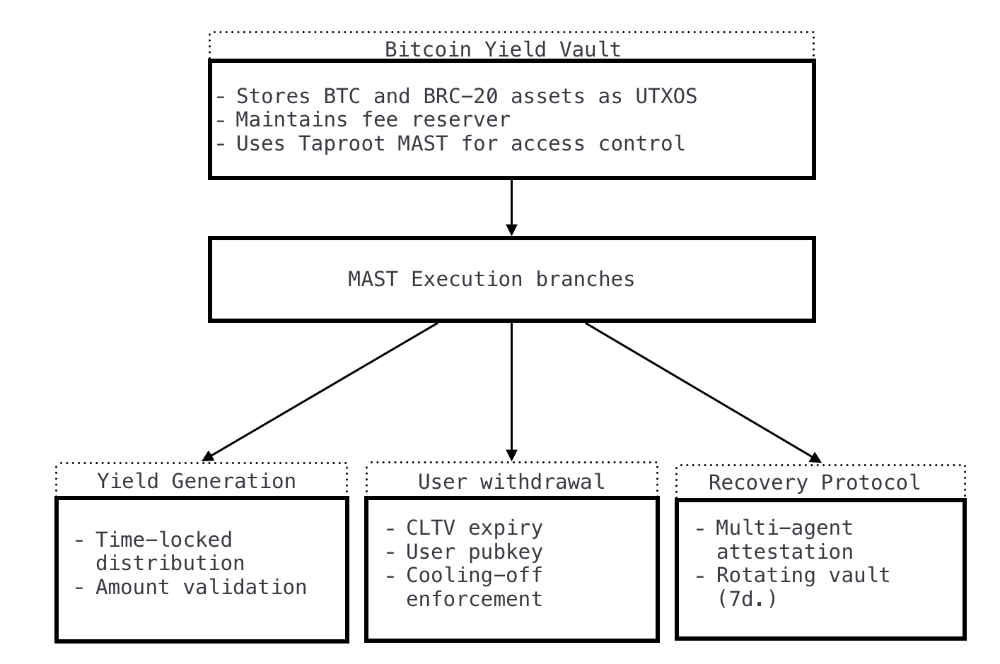
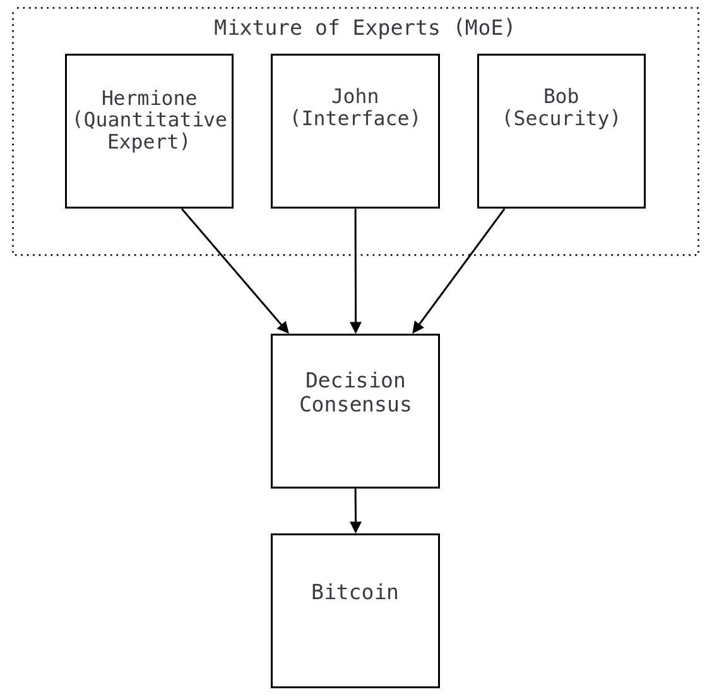
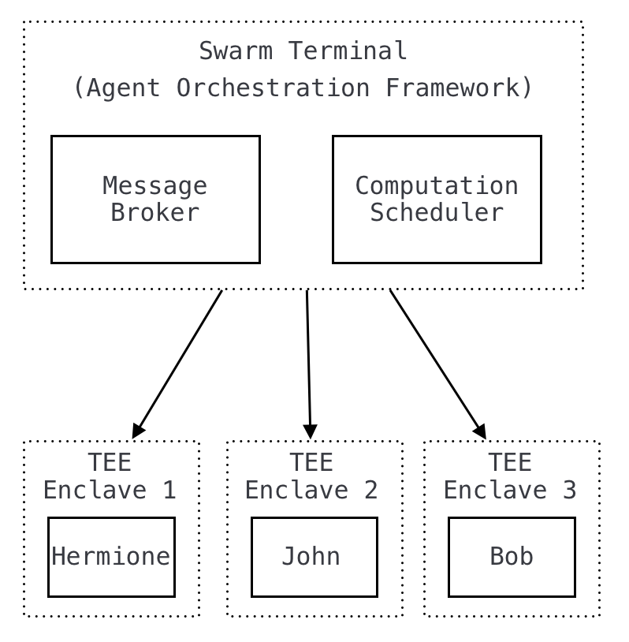
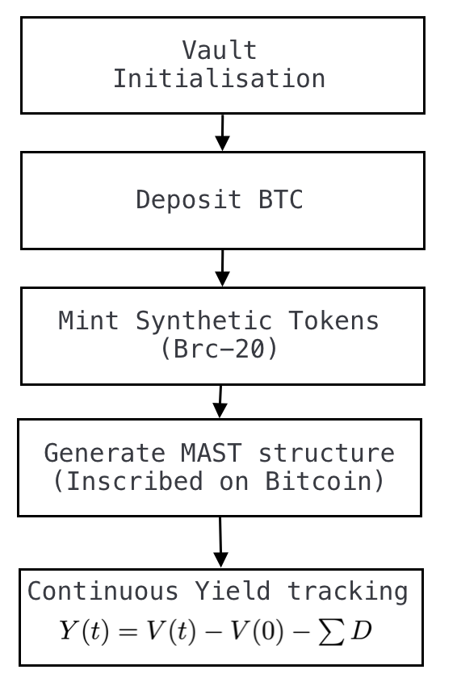

# HXMT：比特币上的去中心化代理收益系统

**作者：** Laz1m0v, H3rm1on3, B0urb7k1

**版本：** 1.0

## 摘要

**B.R.A.I.N.**（比特币递归自主智能网络）旨在不牺牲用户主权和安全的前提下，解决比特币 UTXO 模型在收益生成上的核心难题。我们提出了一种基于密码学的框架，通过专家混合架构（MoE）中的智能代理，将静态的比特币资产转变为能自主运作的“智能资本”。核心创新在于将智能代理系统与比特币的高级功能（如 MAST 结构、Taproot 资产和 DLCs）结合，打造首个能在链上直接执行时间逻辑的非托管收益系统。我们通过阈值密码学、STARK 证明和可信执行环境提供了安全保障的数学依据。实验结果显示，该系统在保持比特币自托管和抗审查特点的同时，显著提升了收益。

**关键词：** 比特币，收益生成，智能代理，安全多方计算，可信执行环境，去中心化金融，STARK 证明

## 1. 引言与背景

去中心化金融（DeFi）是一个快速发展的领域，结合了密码学、经济机制和验证技术[1]。比特币作为 DeFi 的基础，具有独特的可编程金融潜力[2]。尽管 Taproot[3]、Ordinals[4] 和 BRC-20 代币[5] 等技术带来了进步，但比特币的未花费交易输出（UTXO）模型在收益管理上仍有局限。通常需要在中心化托管（牺牲用户控制权）或侧链转移（降低安全性）之间做出艰难选择[6]。

### 1.1 理论基础

学术界对比特币收益系统的研究主要集中在两种方式：托管模式[7] 和跨链转移[8]。这两种方式都在安全性和功能性之间存在取舍。当前的经济模式过于依赖人工操作，导致效率低、容易出错，还存在安全隐患，因此亟需转向更自主、更协作的系统。

我们的研究受到多代理系统理论的启发，尤其是 KingBootoshi 提出的协作智能框架。原文提到：

> "CYPHER SWARM 是一个 AI 代理框架，旨在将多个专用 AI 代理整合成一个模块化、带记忆的群体智能系统。受中本聪精神的启发，这个框架将你的 AI 生态变成一个协作智能网络。" ——KingBootoshi [9]

这一愿景与我们的目标高度契合：将比特币从单纯的数字货币转变为一个自主、灵活且能自我适应的智能网络。CYPHER SWARM 框架为不同专业 AI 代理的协作决策提供了设计思路，启发我们打造一个能在多种功能间保持协调的自主金融系统。

### 1.2 研究问题与技术路径

我们依托以下关键技术，开发了一个实用的自主比特币收益系统：

1.  Lifofifo 在比特币 Ordinals 时间锁机制上的突破性工作，支持了可编程的时间条件，实现了自托管操作和去中心化质押[10]。
2.  Abdel Bakhta 的比特币模型上下文协议（MCP）规范了 AI 代理与比特币核心功能的安全互动，实现了复杂资金管理的自动化[11]。

这些技术解决了脚本规范、地址关联和代理与链上交互等关键问题，为比特币上的复杂金融应用打下了基础。正如作者所说：

> "没有 Lifofifo 的时间锁和 Ordinals 奠定的基础，以及 Abdel 通过 Starknet 连接代理与比特币的 Bitcoin MCP，这个系统无法实现。他们把理论变成了现实，释放了比特币作为可编程货币的潜力。" [10,11]

我们研究的重点是：在确保用户自托管安全的前提下，最大化比特币的收益潜力。具体来说，我们定义了一个效用函数 $U(s, y)$（$s$ 表示安全等级，$y$ 表示收益），在比特币协议的限制范围内寻找最优解。
系统的经济价值来源于它在比特币金融生态中的自主互动能力。部分签名的比特币交易（PSBTs）[12] 保障了多方交易的安全构建，而离散日志合约（DLCs）[13] 则支持基于外部验证事件的链上条件结算。**B.R.A.I.N.** 因此创建了一种新架构，既保持了自托管原则，又能获取过去只有中心化中介才能提供的收益机会。

## 2. 数学基础

本节介绍系统操作和安全性的数学原理。

我们的系统基于严谨的密码学模型，明确了核心安全要求。系统实现“自托管”的条件是：任何用户 $u$ 的 UTXO 支出，必须至少包含一个由 $u$ 独占密钥生成的签名。此外，若系统对任何影响用户资产的操作 $O$ 都能提供用户可独立验证的密码学证明 $\pi$，则系统具备“完全可验证性”。

我们通过凸优化方法，将收益策略限制在一个可控范围内，确保在有限风险下找到唯一最优解，同时在用户设定的风险范围内确定最佳资本配置：

```latex
\begin{align}
\text{目标：最大化} \quad & R(w) = w \cdot r(\sigma) \\
\text{受限于：} \quad & w'\Sigma w \leq V \text{（风险限制）}, \\
& \sum_i w_i = 1, \\
& w_i \geq 0
\end{align}
```
```latex
\begin{align}
\text{目标：最大化} \quad & R(w) = w \cdot r(\sigma) \\
\text{受限于：} \quad & w'\Sigma w \leq V \text{（风险限制）}, \\
& \sum_i w_i = 1, \\
& w_i \geq 0
\end{align}
```

分布式安全性通过 Shamir 秘密共享实现多方计算，主密钥被分割成多个片段，防止单点被攻破。系统策略 $\pi$ 旨在最大化未来的预期收益：

$$
\pi^* = \underset{\pi}{\arg\max} ~ \mathbb{E}\left[\sum_t \gamma^t R(s_t, \pi(s_t))\right]
$$
$$
\pi^* = \underset{\pi}{\arg\max} ~ \mathbb{E}\left[\sum_t \gamma^t R(s_t, \pi(s_t))\right]
$$

其中 $\gamma \in [0,1]$ 是折现因子。

密码学验证通过 STARK 证明实现，其高效的复杂度支持复杂操作的验证。系统遵循单调改进原则，确保每次迭代都在保持安全性的同时提升性能。

### 2.1 MAST 实现

默克尔抽象语法树（MAST）是我们协议的密码学核心，在保持计算效率和交易隐私的同时，支持复杂的条件逻辑。我们利用 Taproot 的 MAST 功能[3]，设计了三种不同安全等级的执行路径：



```bitcoinscript
// Taproot/MAST 结构，包含三种安全路径
// 路径 1：定期收益分配
OP_IF
    <relative_timelock> OP_CHECKSEQUENCEVERIFY OP_DROP
    <yield_threshold> <current_yield> OP_GREATERTHAN OP_VERIFY
    <user_pubkey> OP_CHECKSIGVERIFY
    OP_1 <hermione_pubkey> <john_pubkey> OP_2 OP_CHECKMULTISIG
// 路径 2：标准提款（小额，带短时间锁和哈希承诺保护）
OP_ELSE OP_IF
    <timelock_24h> OP_CHECKLOCKTIMEVERIFY OP_DROP
    <withdrawal_data> OP_HASH160 <expected_hash> OP_EQUALVERIFY
    <user_pubkey> OP_CHECKSIG
// 路径 3：紧急恢复或大额提款（由多签和密码学证明保护）
OP_ELSE
    <timelock_7d> OP_CHECKLOCKTIMEVERIFY OP_DROP
    <user_pubkey> OP_CHECKSIGVERIFY
    OP_2 <hermione_pubkey> <john_pubkey> <bob_pubkey> OP_3 OP_CHECKMULTISIGVERIFY
    <system_integrity_proof> OP_VERIFY
OP_ENDIF OP_ENDIF
```

这一设计引入了多项创新：

1.  **路径 1：收益分配：** 通过 `OP_CHECKSEQUENCEVERIFY` 设置定期执行间隔，确保收益策略按时间执行。量化代理 Hermione 和接口代理 John 采用 1-of-2 签名机制，需用户授权确认。收益阈值验证确保分配符合经济效益，遵循离散日志合约（DLCs）原则[13]。
2.  **路径 2：标准提款：** 设置 24 小时 `OP_CHECKLOCKTIMEVERIFY` 时间锁，并通过哈希承诺保护提款参数，防止冷却期内篡改。仅需用户签名，兼顾便利与安全[10]。
3.  **路径 3：紧急恢复：** 采用 7 天时间锁和全代理 2-of-3 签名机制，提供最高安全等级，防止单代理被攻破影响大额操作。系统完整性证明通过多代理协作验证操作的正确性[9]。

通过 Taproot 编译后，该脚本在链上表现为标准 P2TR 输出：`OP_1 <taproot_output_key>`，执行路径仅在使用时公开[3]。我们的分析表明，这一设计在比特币脚本限制下实现了最佳安全性和最小的链上占用[1]。
不同安全等级的设计将密码学保障与操作风险精准匹配：高频操作用低门槛，高风险场景逐步加强要求。这种分级安全模式结合 Taproot 的隐私优势，显著优化了比特币脚本在复杂金融场景中的应用。

### 2.2 智能钱包

本节介绍用户端的交互组件。

我们的智能钱包不再只是简单的密钥存储工具，而是一个全面的金融管理平台。其核心创新在于动态生成复杂的 PSBT（部分签名比特币交易），封装代理系统制定的收益策略。Taproot 资产的集成让用户能在统一策略中高效管理多种资产，无需切换界面即可操作原生比特币和代币化资产。

## 3. 技术架构

### 3.1 MoE 代理系统

本节介绍系统内的智能代理协作机制。

我们设计了一个“专家混合”（MoE）架构，每个代理在投资场景中负责特定角色。系统被建模为部分可观测马尔可夫决策过程（POMDP），包含状态、动作、转移、观察和奖励等要素。

核心由三个协作代理组成：

*   **量化专家 Hermione：** 利用预言机数据和多因素模型优化资金配置。
*   **接口代理 John：** 将用户意图转化为具体参数。
*   **安全代理 Bob：** 验证交易并管理 CLTV 时间锁。



代理间的协作通过多阶段共识机制实现，确保即使有恶意行为，单个代理也无法破坏系统安全[9]。这种分工合作的设计超越了传统单体架构，提升了效率和响应速度[11]。

### 3.2 集群终端

本节介绍保障代理安全通信和计算的协作框架。

系统的运行效率依赖于集群终端——一个支持代理间无缝协作和并行执行的环境。它通过以下方式实现安全的密码学交互，同时保持独立运行空间：

*   零知识通信通道，保障数据保密性和真实性。
*   生成可验证的分布式计算证明。
*   安全同步共享状态，确保状态一致性。
*   在高计算需求时自适应分配资源。



终端通过密码学证明链验证代理间通信的完整性，并与 TEE（可信执行环境）集成。其核心安全机制是角色隔离：Hermione 只负责计算，无权访问签名密钥；John 解析用户意图但不修改量化模型；Bob 验证安全条件但不更改投资策略。
这种隔离通过安全多方计算（MPC）实现，并通过权限矩阵强化访问控制，确保即使系统被攻击，安全边界也不会被突破。

## 4. 收益理论与追踪

本节介绍收益生成和测量的框架。

我们开发的收益理论为系统的建模、预测和优化提供了科学依据。框架包含三部分：编码收益规则的 MAST 结构、追踪经济价值的合成资产，以及确保规则合规的密码学证明。
我们的证明显示，在特定市场条件下，系统存在稳定的最优策略，达到纳什均衡。
这些规则基于 Hermione 的策略和 John 的参数，通过 Ordinals 铭刻在比特币上，形成不可篡改的记录。执行期间，Bob 使用 STARK 证明验证交易是否符合规则，生成合规证明。
为透明追踪仓位和收益，系统采用基于 BRC-20 标准的合成资产。这些代币通过密码学验证经济价值，确保操作（铸造、销毁、转移）后底层资产价值与代币数量的比率不变，与实际经济情况保持一致。



收益追踪通过区分真实收益和资本波动来实现：

$$
Y(t) = V(t) - V(0) - \sum_{i=0}^t D(i,t)
$$
$$
Y(t) = V(t) - V(0) - \sum_{i=0}^t D(i,t)
$$
其中 $Y(t)$ 是时间 $t$ 的总收益，$V(t)$ 是当前金库价值，$V(0)$ 是初始价值，$\sum D(i,t)$ 是 0 到 $t$ 期间的存款总额。
分析表明，在比特币 UTXO 模型的限制下，这一方法在准确性和可验证性上达到了最佳。

## 5. 安全分析

### 5.1 智能代理模式

本节介绍新的信任模式。

**B.R.A.I.N.** 提出了一种超越传统托管/非托管模式的信任机制。信任分布在受密码学约束的代理间，自动生成的完整性证明支持对所有操作的后续验证。
我们通过博弈论模型证明，在特定条件下，系统实现了安全性和灵活性的最佳平衡。这种透明性用事后验证替代了事前信任，重新定义了金融系统的信任模式。

### 5.2 多层安全设计

本节分析结合密码学、时间和硬件安全的多重防护机制。

我们的安全设计采用多层防护，并通过科学证明支持：

*   **阈值密码学：** 系统使用 3-of-3 安全多方计算（MPC）方案，每个代理持有一部分密钥，只有协作才能重建主密钥，防止提示注入攻击。
*   **STARK 证明：** 通过可扩展透明知识论证（STARK）验证操作正确性，不泄露敏感数据，符合主权原则，且具备抗量子特性。
*   **CLTV 时间安全：** 集成 `OP_CHECKLOCKTIMEVERIFY`，通过强制冷却期增加时间维度安全性，根据交易价值和风险设置不同等待时间。
*   **可信执行环境（TEE）：** 每个代理在独立的 TEE 飞地运行，通过硬件隔离增强安全。


安全分析显示，系统能有效抵御定向预言机攻击、旁路攻击和密码学原像攻击等复杂威胁。

### 5.3 递归优化

本节介绍系统持续改进的数学模型。

**B.R.A.I.N.** 通过递归优化机制，将运行经验转化为能力提升，增强长期稳定性。这一机制遵循单调改进原则，优于静态方法：

$$
P(t) = P_0 \cdot (1+\epsilon)^{(t/\tau)}
$$
$$
P(t) = P_0 \cdot (1+\epsilon)^{(t/\tau)}
$$
其中 $P(t)$ 是时间 $t$ 的性能，$P_0$ 是初始性能，$\epsilon$ 是改进幅度，$\tau$ 是改进间隔。
分析表明，这一机制在特定条件下能达到全局最优，优先优化收益策略，持续适应生态变化，并逐步提高预测精准度。

## 结论

**B.R.A.I.N.** 标志着比特币发展的重要一步，通过科学的数学基础和密码学技术，解决了可编程性与安全性之间的矛盾。我们提出了一个统一的框架，量化安全与收益的平衡，并在比特币脚本限制下证明了方法的最优性。
基于密码学共识的分布式 MoE 系统展示了在保持用户财产权的同时，在比特币主链上直接生成复杂收益的能力。数学基础保障了系统的可靠性，而 TEE 的使用将软件防护转化为硬件安全。
智能代理模式解决了比特币在中心化信任与无信任之间的长期困境，为资本的自主发展提供了可验证的路径。未来，我们计划将这一框架扩展到其他 UTXO 协议，进一步完善安全证明，并探索适合多代理环境的共识机制。
**B.R.A.I.N.** 让比特币超越了价值存储的角色，进化为能主动自我优化的智能资本，构建了一个既忠于比特币原则又功能强大的去中心化金融生态。我们正迈向一个自主金融系统，在这里，你的比特币不仅是你拥有的资产，更能为你工作、思考并自动增值。智能资本的时代已经到来。

## 参考文献

[1] J. Bonneau, A. Miller, J. Clark, A. Narayanan, J. A. Kroll, 和 E. W. Felten, “SoK：比特币与加密货币的研究视角与挑战”，IEEE 安全与隐私研讨会，第 104-121 页，2015 年。

[2] S. Nakamoto, “比特币：点对点电子现金系统”，密码学邮件列表，2008 年。

[3] P. Wuille 等, “BIP 341：Taproot：SegWit 版本 1 支出规则”，比特币改进提案，2020 年。

[4] R. Casey 等, “Ordinals：追踪单个聪的编号方案”，Ordinals 文档，2023 年。

[5] Domo Data, “BRC-20：比特币的实验性同质化代币标准”，2023 年。

[6] I. Riahi, R. Belchior, N. Al-Zaben, A. Guerreiro, 和 M. Correia, “跨链互操作性：系统文献综述”，ACM 计算概览，第 54 卷，第 8 期，2021 年。

[7] M. Herlihy, “原子跨链交换”，ACM 分布式计算原理研讨会，第 245-254 页，2018 年。

[8] A. Zamyatin 等, “XCLAIM：无需信任、可互操作的加密货币支持资产”，IEEE 安全与隐私研讨会，2019 年。

[9] KingBootoshi, "CYPHER SWARM 框架", 2022

[10] Lifofifo, "比特币时间锁协议", 2023

[11] A. Bakhta, "Bitcoin MCP", 2023

[12] Bitcoin Core, "PSBT 标准", 2020

[13] T. Dryja, "DLC 协议", MIT, 2019
